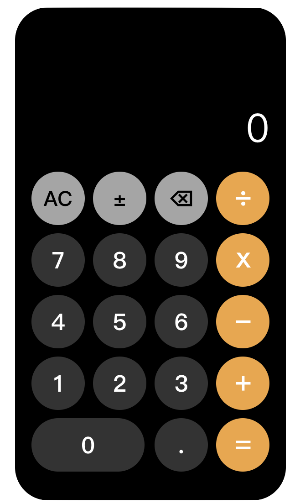

# Simple Calculator
This project is a simple calculator created using React. The user interface is inspired from the Calculator app on iPhones. It has buttons for numbers and operators, with a display showing the input and results.

The calculator can perform the four basic mathmatical operations: addition, subtraction, multiplication, and division.

<p align="center">

</p>

## Getting Started
Running the application requires the runtime environment Node.js and npm. Make sure these are installed on your computer. 

First, in order to run the application, <b>node_modules</b> folder needs to be installed locally. 
There is a <b>package.json</b> file inside the project's main folder. 
Type the following command inside a terminal, with the terminal pointing to the directory that contains the <b>package.json</b> file.
```
npm install
```
This command will install the <b>node_modules</b> folder with all the npm packages necessary for running this application. Once the command is finished, the app can now be served locally by running the following command:

```
npm start
```
This will end up with the following output in the terminal:
<p align="Center">
Compiled successfully!
</p>
We now have the application running on <b>localhost:3000</b>. 
To view the application, open a browser with the address bar pointing to http://localhost:3000, and now you can start exploring the calculator application!
